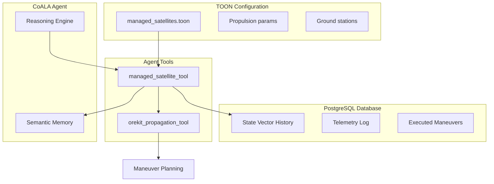

# Managed Satellites Feature

## Architecture Overview




## Data Model

### 1. TOON Configuration File (`data/managed_satellites.toon`)

Stores satellite configuration, propulsion system specs, and operational parameters:

```
ManagedSatellite[
  id: "sat-001"
  name: "TUM-SAT-1"
  norad_id: 99001
  cospar_id: "2024-001A"
  
  propulsion: Propulsion[
    type: "electric"
    thrust_n: 0.015
    isp_s: 1500
    fuel_mass_kg: 2.5
    fuel_remaining_kg: 2.1
    max_delta_v_m_s: 150
  ]
  
  spacecraft: SpacecraftParams[
    dry_mass_kg: 12.0
    drag_area_m2: 0.25
    drag_cd: 2.2
    srp_area_m2: 0.3
    srp_cr: 1.5
  ]
  
  operations: Operations[
    ground_stations: ["munich", "garching"]
    min_elevation_deg: 10
    active: true
  ]
]
```

### 2. Database Models (extend `agent/data_pipeline/models.py`)

Add new tables for precise telemetry:

- **ManagedSatellite** - Links to config, stores DB reference
- **StateVectorHistory** - Position/velocity with covariance at epochs
- **OEMSegment** - Parsed OEM ephemeris segments
- **TelemetryPoint** - Raw telemetry measurements
- **ExecutedManeuver** - Actual maneuvers performed (thrust, duration, delta-v achieved)

## Implementation

### 1. Create Configuration Schema

File: `data/managed_satellites.toon`

- Define managed satellites with propulsion and spacecraft parameters
- Include operational constraints and ground station links

### 2. Extend Database Models

File: `agent/data_pipeline/models.py`

- Add `ManagedSatelliteDB` model linking to TOON config
- Add `StateVectorHistory` with position, velocity, covariance matrix
- Add `ExecutedManeuver` tracking actual burns
- Add `TelemetryPoint` for raw measurements

### 3. Create Managed Satellite Tool

File: `tools/managed_satellite_tool.py`

Actions:

- `list_managed` - List all managed satellites
- `get_satellite` - Get satellite config + current state
- `update_state` - Store new state vector from telemetry
- `import_oem` - Parse and store OEM ephemeris
- `get_state_history` - Retrieve state vector history
- `compute_maneuver` - Plan maneuver using Orekit (calls orekit_propagation_tool)
- `record_maneuver` - Log executed maneuver, update fuel
- `get_delta_v_budget` - Calculate remaining delta-v capacity
- `predict_position` - High-fidelity propagation with spacecraft params

### 4. Update Tools Metadata

File: `tools/tools_metadata.toon`

- Add `managed_satellite` tool definition

### 5. Add OEM Parser Utility

File: `utils/oem_parser.py`

- Parse CCSDS OEM files to extract ephemeris data
- Convert to Orekit-compatible format

## Key Integration Points

### With Orekit Tool

The managed satellite tool will call `orekit_propagation_tool` internally for:

- Numerical propagation with spacecraft-specific drag/SRP coefficients
- Maneuver computation (Hohmann, bi-elliptic, station-keeping)
- Ground station visibility using actual spacecraft parameters

### With Semantic Memory

Store satellite facts for agent retrieval:

- Current orbital regime
- Fuel status alerts
- Recent maneuver history

## Example Agent Interaction

```
User: "What's the current delta-v budget for TUM-SAT-1?"

Agent uses managed_satellite_tool:
1. get_satellite(id="sat-001") -> Gets config with propulsion params
2. get_delta_v_budget(id="sat-001") -> Calculates from fuel remaining + Isp

Response: "TUM-SAT-1 has 45.2 m/s delta-v remaining (2.1 kg fuel, Isp=1500s)"
```

```
User: "Plan a 50m altitude raise maneuver for TUM-SAT-1"

Agent uses:
1. managed_satellite_tool.get_satellite -> Current state + propulsion
2. orekit_propagation_tool.compute_hohmann -> Delta-v required
3. managed_satellite_tool.compute_maneuver -> Burn plan with timing
4. Returns maneuver plan with fuel cost and timeline
```

## Files to Create/Modify

| File | Action |

|------|--------|

| `data/managed_satellites.toon` | Create - satellite configurations |

| `agent/data_pipeline/models.py` | Modify - add new DB models |

| `tools/managed_satellite_tool.py` | Create - new tool |

| `tools/tools_metadata.toon` | Modify - add tool definition |

| `utils/oem_parser.py` | Create - OEM file parser |

| `migrations/002_managed_satellites.sql` | Create - DB migration |